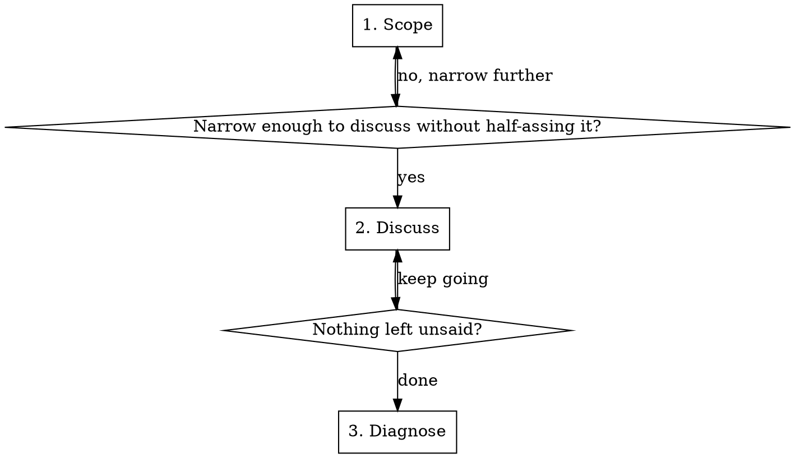

# Code Autopsy: Scope, Discuss, Diagnose

Examine unfamiliar or neglected code to understand what it does, whether it matches what you actually needed, and what to do about the gap.

## The Flow

---

## 1. Scope

The user points at code. Your job is to **grill them down** to a scope you can hold in context without bloating. Use `ask_question` here — short, targeted scoping questions work well in the modal.

Questions to resolve:
- What exact part do you want to look at? (file, function, flow, component)
- What triggered this? (broken, outdated, inherited, forgotten, "I don't remember what this does")
- What are you hoping to decide? (keep it, rewrite it, understand it, modernize it)

Done when the scope is tight enough that you can read the relevant code and discuss it without context degradation.

---

## 2. Discuss

Read the scoped code. Then present a **rich walkthrough in chat** as formatted markdown — NOT through ask_question (the modal is too small for this).

**Open with anatomy:** What the code does, what it depends on, how it fits into the broader system. Link to exact lines.

**Then the intent check:** *"Is this what you actually needed this part to do, or has the requirement shifted?"* This is the critical question. The gap between intent and implementation is where all the insight lives.

**Then the conversation.** This is not a form. Respond to what the user says. Challenge back. If they say "yeah but the requirement changed," explore what it changed to. If they say "this was supposed to handle X too," dig into why it doesn't. Suggest modern alternatives where the current approach smells. Push back when their instinct is to rewrite something that's actually fine.

The discuss phase is done when both sides have nothing left to say about the scoped code.

---

## 3. Diagnose

Write `autopsy/<target-slug>.md` capturing the conversation's findings — not from a fixed template, but from what was actually discussed. The document covers:

1. **What the code does** — the anatomy, as discovered during discussion
2. **What you actually wanted it to do** — the user's intent, which may differ from implementation
3. **The gap** — what's right, what's wrong, what shifted since it was written
4. **The prescription** — concrete next steps with the agreed verdict baked in

Present an executive summary in chat after writing the file. If the prescription calls for implementation work, recommend transitioning to `writing-plans`.

---

## Quick Reference

| Step | Tool | Output |
|------|------|--------|
| Scope | `ask_question` | Narrowed target |
| Discuss | Rich markdown in chat | Shared understanding |
| Diagnose | Write to disk | `autopsy/<target-slug>.md` |

---

## Common Mistakes

| Mistake | Fix |
|---------|-----|
| Scoping too wide — trying to autopsy an entire feature area | Grill harder. If parts are independent, autopsy them separately. |
| Using ask_question for the walkthrough | Present anatomy and analysis as rich markdown in chat. The modal is too cramped for deep analysis. |
| Skipping the intent check | Always ask what the code was *supposed* to do. The gap between intent and reality is the whole point. |
| Being a mirror — reflecting what the user says without challenging | Push back. Suggest alternatives. Question assumptions. You're a diagnostic partner, not a scribe. |
| Writing code during the autopsy | This is purely diagnostic. Finish the diagnosis first, then transition to implementation. |
